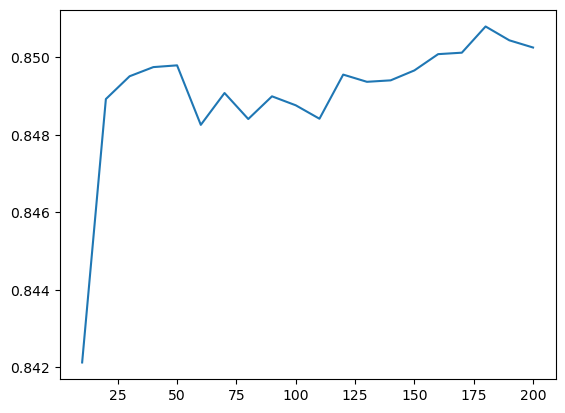
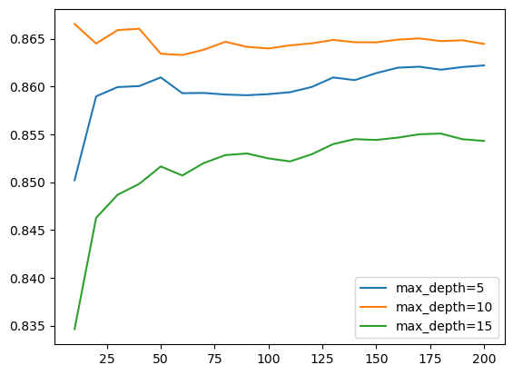
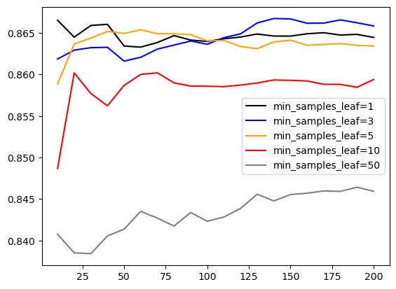
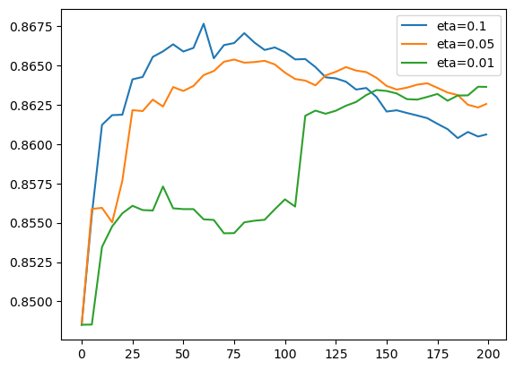
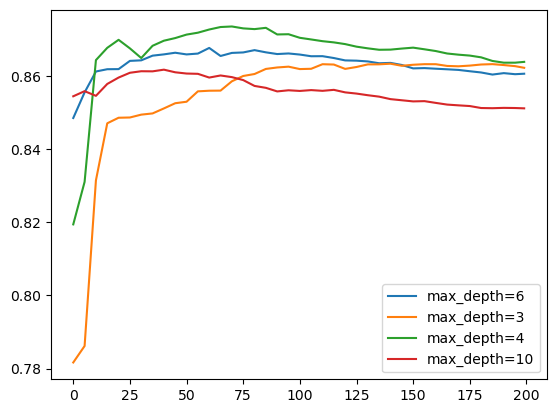
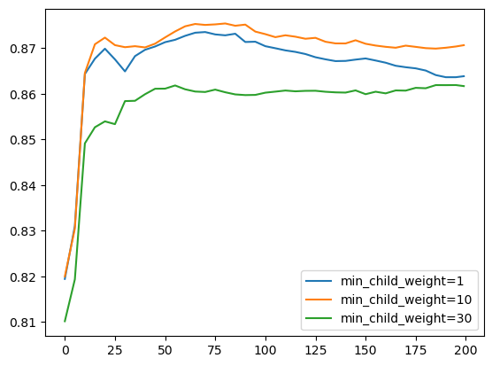
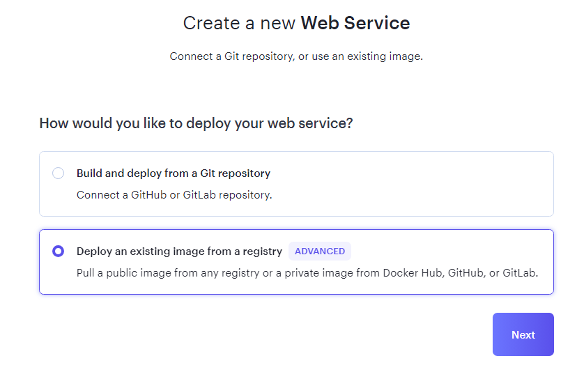
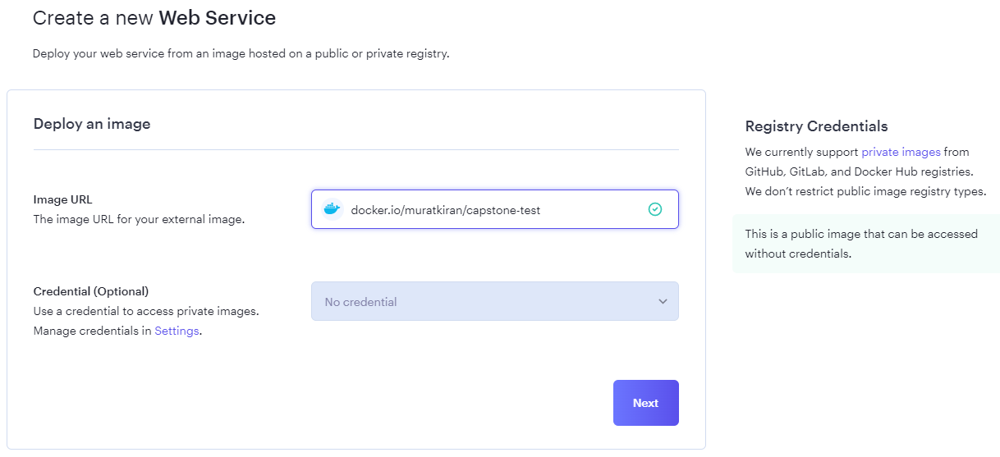
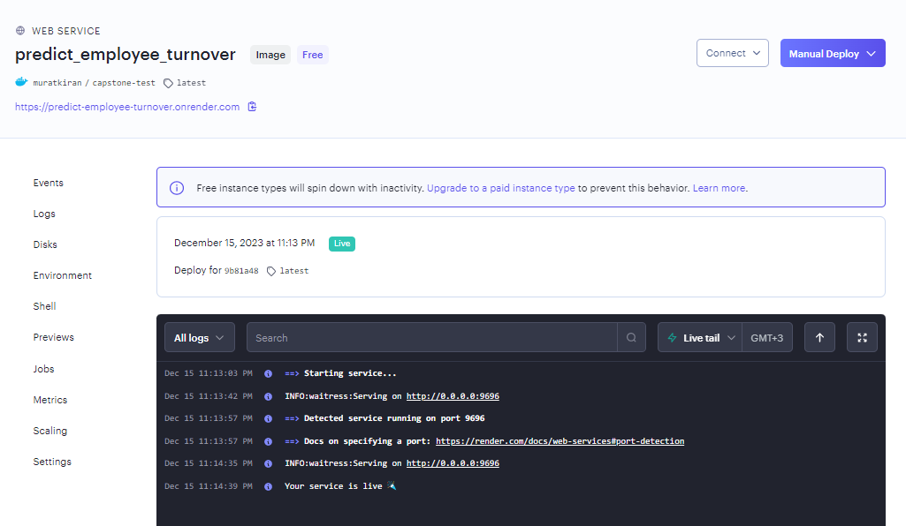

# Employee Turnover Prediction


## Dataset Overview

**About the Data**
The dataset comprises various features, both categorical and numerical, aiming to predict whether employees will leave the company in the future. These attributes provide valuable insights for HR decision-making and employee retention strategies.

**Dataset Details:**
- **Education:** Education level of the employee.
- **JoiningYear:** Year in which the employee joined the company.
- **City:** City where the employee's office is located.
- **PaymentTier:** Payment tier categorization (1: Highest, 2: Mid Level, 3: Lowest).
- **Age:** Current age of the employee.
- **Gender:** Gender of the employee.
- **EverBenched:** Whether the employee has ever been kept out of projects for 1 month or more.
- **ExperienceInCurrentDomain:** The number of years of experience employees have in their current field.
- **Label:**
  - **LeaveOrNot:** Binary indicator of whether the employee is predicted to leave the company in the future (1: Leaves, 0: Stays).

**Dataset Source:**
The dataset can be found on [Kaggle](https://www.kaggle.com/datasets/tawfikelmetwally/employee-dataset/data).

## Problem Description

The primary objective is to develop a predictive model that accurately forecasts employee turnover in the future. The model's insights will empower HR teams to proactively address retention challenges and implement strategic initiatives to enhance employee satisfaction, ultimately reducing attrition.

## 1. Exploratory Data Analysis (EDA)

- **Analysis of Categorical Variables:**

    - **Education Distribution:**
        - Visual representation of the distribution of education levels.
        - 

    - **City Distribution:**
        - Exploration of the distribution of the cities where employees' offices are located.
        - 

    - **Gender Distribution:**
        - Examination of the distribution of genders among employees.
        - 

    - **Ever Benched Distribution:**
        - Analysis of the distribution of employees who have been benched.
        - 

    - **Joining Year Distribution:**
        - Visualizing the distribution of the years when employees joined the company.
        - 

    - **PaymentTier Distribution:**
        - Distribution of payment tier categorization.
        - 
              
- **Analysis of Numerical Variables:**

    - **Age Distribution:**
        - Investigating the distribution of ages among employees.
        - 

    - **Experience in Current Domain Distribution:**
        - Examining the distribution of years of experience in the current domain.
        - 

### Target Variable Analysis:

#### Target Summary with Numeric:

- **Age:**
    - Leave: 29.052500
    - Stay: 29.571896

- **Experience in Current Domain:**
    - Leave: 2.840000
    - Stay: 2.940059

#### Target Summary with Categorical:

- **Education:**
    - Bachelors: 0.313524
    - Masters: 0.487973
    - PHD: 0.251397

- **City:**
    - Bangalore: 0.267056
    - New Delhi: 0.316335
    - Pune: 0.503943

- **Gender:**
    - Female: 0.471467
    - Male: 0.257739

- **Ever Benched:**
    - No: 0.331257
    - Yes: 0.453975

- **LeaveOrNot:**
    - 0: 0.0
    - 1: 1.0

- **Joining Year:**
    - 2012: 0.216270
    - 2013: 0.334828
    - 2014: 0.247496
    - 2015: 0.407170
    - 2016: 0.222857
    - 2017: 0.268051
    - 2018: 0.986376

- **PaymentTier:**
    - 1: 0.366255
    - 2: 0.599129
    - 3: 0.275200

## 2. Prepare Data for Model Training

- Extract only those rows in the column `LeaveOrNot` where the value is either `Stay` or `Leave`.
- Split the data into train, validation, and test sets in a two-step process, resulting in a distribution of 60% train, 20% validation, and 20% test sets. Use a random seed of `11`.
- Prepare the target variable `LeaveOrNot` by converting it from categorical to binary, where 0 represents `Stay` and 1 represents `Leave`.
- Delete the target variable from the train, validation, and test dataframes.

## 3. Training Models

We aim to identify the most suitable model by training various models and evaluating their performance using the roc_auc_score. The model with the highest roc_auc_score will be considered the most effective.

### Decision Tree

- Use `DecisionTreeClassifier()`.
- Compare `y_pred` (with `X_train`) and `y_train`, it shows `roc_auc_score = 0.9855092934065315`.
- Compare `y_pred` (with `X_val`) and `y_train`, it shows `roc_auc_score = 0.7861772633103365`. The training model seems to be overfitting.

**Tuning:**
- `max_depth` (how many trees): pick a relatively high roc_auc_score value; the result can be varied.
- `min_samples_leaf` (how big the tree is): set a range of max_depth from the last step, in each depth, loop through a group of `min_samples_leaf`.
  - Make a dataframe of `"max_depth", "min_samples_leaf", "roc_auc_score"` and use seaborn to generate a heatmap; select one of the best combinations, e.g., `max_depth=6`, `min_samples_leaf=5`.
  
  - Calculate the roc_auc_score.

### Random Forest
- `from sklearn.ensemble import RandomForestClassifier`
- pick a range from 10 to 200 to train the model
- turn it to dataframe and plot it (`n_estimators = 180` seems to be the best), but we dont fix it yet
  

**Tuning:**
- `max_depth`: range [5, 10, 15]
    - For each depth, loop through all `n_estimators`.
    - Set the seed to fix the result with `random_state=1` to help the model process faster [optional]`n_jobs=-1`.
    - Plot the result to find the best `max_depth`: 10.
    
- `min_samples_leaf` (how big the tree is): range [1, 3, 5, 10, 50]
    - For each `min_samples_leaf`, loop through all `n_estimators`.
    - Set `max_depth` to 10, set the seed to fix the result with `random_state=1` to help the model process faster [optional]`n_jobs=-1`.
    - Plot the result to find the best `min_samples_leaf`: 3.
    
- Use `n_estimators=180, max_depth=10, min_samples_leaf=3` to train the model.
- The roc_auc_score result has improved compared to the decision tree model.

### XGBoost
- `import xgboost as xgb`
- train the model
    ```features = list(dv.get_feature_names_out())
    dtrain = xgb.DMatrix(X_train, label=y_train, feature_names=features)
    dval = xgb.DMatrix(X_val, label=y_val, feature_names=features)```
- xgb_output(output) function to capture the output 
- plot the graph
  

**Tuning**                                                                                                                                                                      
    XGBoost has various tunable parameters but the three most important ones are:

- `eta` (default=0.3)
  - It is also called `learning_rate` and is used to prevent overfitting by regularizing the weights of new features in each boosting step. range: [0, 1]
- `max_depth` (default=6)
  - Maximum depth of a tree. Increasing this value will make the model mroe complex and more likely to overfit. range: [0, inf]
- `min_child_weight` (default=1)
  - Minimum number of samples in leaf node. range: [0, inf]
    - Tuning the learning rate helps you tell the model what speed it would use in deriving the minimum for the weights.
    `eta=0.1` is the best (faster and more accurate)
  
    - `max_depth`: how many trees? `max_depth=4` is the best.
  
    - `min_child_weight`: how big is the tree? `min_child_weight=10` is the best.
      

## 4. Choose the Final Model and Model Testing

- **XGBoost** was selected as the final model, which yielded the best results.
- Use the full train dataset to train the model again and Test.
- Repeat the previous steps to obtain the feature matrix, train the model, and test it with the test dataset.
- Evaluate the final model's performance on the test dataset.
- Review the results to ensure the model's performance meets the desired criteria.

## 5. Save and Transfer Model

### Save the Model
- Utilize the `pickle` library to save the trained XGBoost model.

### Transfer the Training Model to a Script
- Create a script named `train.py`.
- Save the trained model in a file named `model.bin`.

## 6. Web Service with Flask

- Create a file named `predict.py`.
- Open a terminal and run `python predict.py` to start the server. 
- Open another terminal and run `python predict-test.py`. If it displays `{'turnover': True or False, 'turnover_probability': xxxxx}`, it indicates that the model and server are functioning. The `predict-test.py` file contains a sample employee information.
- Use `Ctrl + c` to stop the server.

## 7. Virtual Environment

- To build a virtual environment, run `pip install pipenv`.
- Install required packages with `pipenv install numpy sklearn==1.3.1 flask waitress xgboost requests`.
- Use `pipenv shell` to enter the virtual environment.

## 8. Docker

To isolate the environment from the host machine, follow these steps:

1. Choose a Python version for your Docker image. You can find Docker images [here](https://hub.docker.com/_/python). 

2. Create a file named `Dockerfile` with the following content:
    ```Dockerfile
    # Install Python
    FROM python:3.10.13

    # Install pipenv
    RUN pip install pipenv

    # Create and go to the directory
    WORKDIR /app

    # Copy files to the current directory
    COPY ["Pipfile", "Pipfile.lock", "./"]

    # Install packages and deploy them
    RUN pipenv install --system --deploy

    # Copy files to the current directory
    COPY ["predict.py", "model.bin", "./"]

    # Open port
    EXPOSE 9696

    # Execute the service, bind the host port to 9696
    ENTRYPOINT ["waitress-serve", "--listen=0.0.0.0:9696", "predict:app"]
    ```

3. Build the Docker image using the following command:
    ```bash
    docker build -t your_image_name .
    ```
    - Replace `your_image_name` with a name of your choice.

4. Run the Docker container:
    ```bash
    docker run -it --rm -p 9696:9696 your_image_name
    ```
    - `it`: access to terminal.
    - `--rm`: remove the container after stopping it.
    - The `-p` option binds the host port to the container port.

## 9. Cloud Deployment

1. **Push your image to Docker Hub:**

    First, push your Docker image to Docker Hub by executing the following commands in your terminal:

    ```bash
    docker login
    docker tag your_image_name YOUR_DOCKERHUB_NAME/image_name
    docker push YOUR_DOCKERHUB_NAME/image_name
    ```

    Replace `your_image_name` with the name of your Docker image, and `YOUR_DOCKERHUB_NAME/image_name` with your Docker Hub username and the name you want for your image.

2. **Deploy on Render:**

    - Open [Render](https://render.com/) in your web browser.

    - Create a new web service by selecting "Deploy an existing image from a registry."

    

    - Enter the image URL in the format "YOUR_DOCKERHUB_NAME/image_name."

    

    - Complete the configuration and initiate the web service.

    

3. **Configure Predict Cloud File:**

    - Set the host in `predict-cloud.py` to the URL provided by Render for your deployed web service.

4. **Run the Cloud Service:**

    - Open a new terminal and run the following command:
    
        ```bash
        python predict-cloud.py
        ```

5. **View the Final Result:**

    - Check the result in your Render dashboard or visit the provided URL. The final result should be displayed.

    

Now, deploy your web service, which hosts the model, to the cloud. Access it through the provided URL
